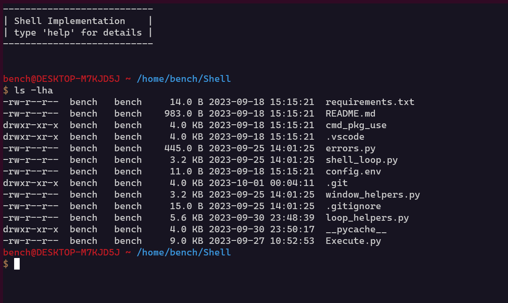

---

# Shell Implementation in Python using Curses library. 

## Overview
This project provides a custom shell implementation using the curses library in Python. It is designed to run on Linux systems and has been tested on Ubuntu. This shell offers a range of commands and showcases the capabilities of curses windows and pads, going beyond basic single-windowed examples found in GeeksforGeeks tutorials on this stuff. The docs on this module don't offer many examples on usage, and everytime I looked up anything for the curses module in python I was met with pure disappointment. The shell is pretty cool and can be taken to new heights pretty quickly because it is super easy to add new commands, simply go to the cmd_pkg directory.

## Installation and Usage
1. Clone the repository to your local machine.
2. Run the shell using the following command:
   ```
   python3 shell_loop.py
   ```

   

## Features
- **Custom Command Parsing:** The parsing method applied to commands is unique. Detailed explanations of the parsing logic are available in `Execute.py`.
- **Curses Library Usage:** Demonstrates advanced uses of curses windows and pads. Relevant code is found in `loop_helpers.py`, `window_helpers.py`, and `shell_loop.py`.
- **Command Execution Logic:** Implemented in `cmd_pkg_use` and `Execute.py`.

## Available Commands
- **Basic Navigation and File Management:** `ls`, `cd`, `mkdir`, `rmdir`, `touch`, `cp`, `mv`, `rm`
- **File Content Manipulation:** `cat`, `grep`, `sort`, `head`, `tail`, `wc`
- **System and Permissions:** `pwd`, `chmod`, `history`, `exit`
- **Examples:** Each command supports various flags and arguments. For example:
  - `grep keyword file.txt`
  - `cat file1 file2 > file3`
  - `ls -lah`
  - `chmod 777 file.txt`

## Getting Started
- To understand the shell's functionalities and command handling, type `help` after starting the shell. This will provide detailed information on command processing, pipe handling, redirections, and flag interpretations.

## Contributing
- Contributions to enhance the shell, add new features, or improve documentation are welcome. Please follow standard GitHub pull request procedures.


Certainly! Below is a documentation outline describing the purpose of each file and directory in your project structure:

---

# Project Structure Documentation

## Directory and File Descriptions

### .vscode
- **Purpose:** Contains Visual Studio Code specific settings and configuration files. These files are used to customize the IDE environment for this project.

### __pycache__
- **Purpose:** Stores Python 3 bytecode compiled files. These are automatically generated by Python to speed up program execution.

### cmd_pkg_use
- **Purpose:** Package that implements all of the commands and the class to process the commands.

### .gitignore
- **Purpose:** Lists files and directories that are to be ignored by Git version control. This typically includes compiled files, local configuration files, and other non-source-code related files.

### Execute.py
- **Purpose:** Main script responsible for executing commands within the shell environment. This file contains logic for parsing and running commands entered by the user.

### config.env
- **Purpose:** Contains environment-specific variables. This file is used to store configuration settings that can be accessed by the application at runtime.

### errors.py
- **Purpose:**  error handling exceptions specific to this project.

### loop_helpers.py
- **Purpose:** helper functions used in the main loop within the shell.

### requirements.txt
- **Purpose:** Lists all Python dependencies required by the project. This file is used for easy installation of necessary libraries via package managers like pip.

### shell_loop.py
- **Purpose:** The main script that runs the shell loop, accepting user input and responding accordingly. This file is central to the shell's functionality.

### window_helpers.py
- **Purpose:** Contains helper functions or classes related to the windowing aspects of the project, implements a lot of helper functions surrounding the windowed object. 

---

## Acknowledgments
- This project aims to contribute to the community by providing a detailed example of a shell implementation using curses in Python, addressing the lack of comprehensive resources on this topic across the internet and official documentation.

---
